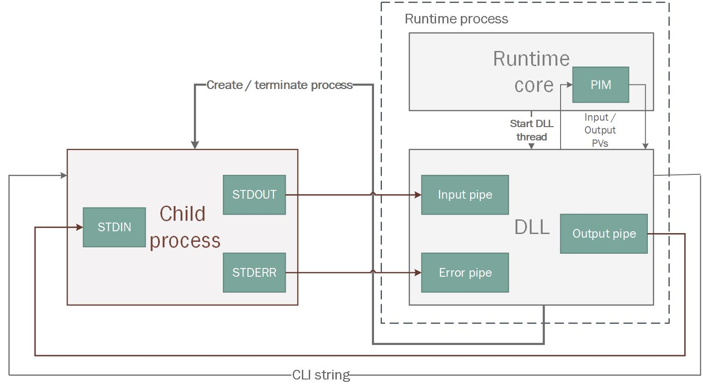
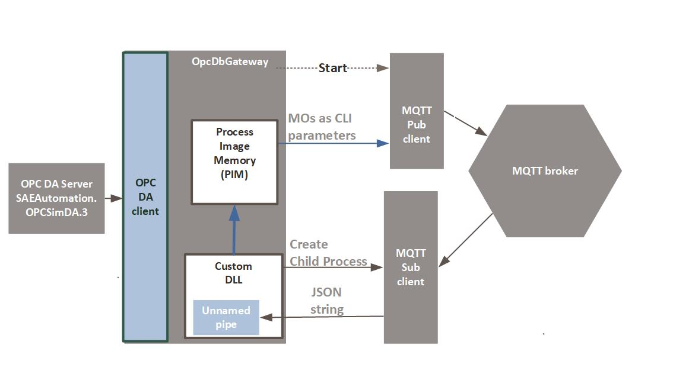
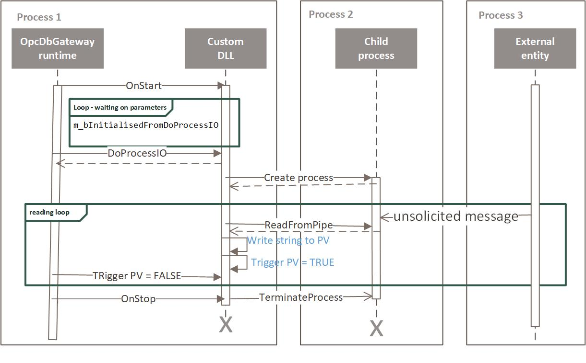
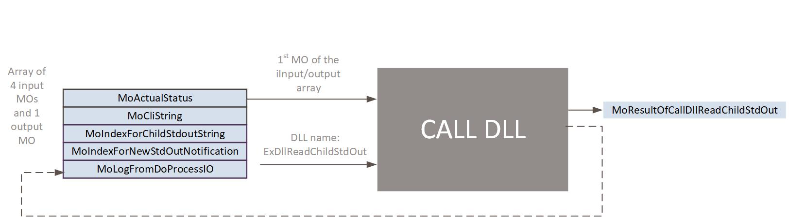

Using standard streams of a child process to implement plug-ins.
================================================================

Vladimir Palacka, SAE ‐ Automation, s.r.o. (Slovakia). Trenčianska 19, NOVA DUBNICA 01851, email: [vladimir\_palacka@saeautom.sk](mailto:vladimir_palacka@saeautom.sk)

**Keywords:**

Application development toolbox, Inter-process Communication, Communication Middleware, Communication over pipe

**Abstract:**

_OpcDbGateway enables_ _the processing of data collected from different external processes and writing the data to them using different means of inter-process communication. This article describes the possible implementations and one specific implementation of inter-process communication based on piping of standard outputs of an external process to the OpcDbGateway runtime process. Ready-made or custom console applications communicating over pipes or parameters of a command line interface string can considerably enhance the_ **configurable** _and/or the_ **programmed functionality** _of integrated applications based on OpcDbGateway.  _

Introduction
-------------

OpcDbGateway **is an application software development product** consisting of an **IDE** (GUI) for creating and debugging applications and a **runtime engine/application** without IDE. The OpcDbGateway configuring/programming methodology is similar to that used in programmable logic controllers (PLC). It is based on the use of **Function Blocks** (FB). They consist of **configurable commands**. The runtime application executes the configurable commands that are saved in a configuration created by the IDE. There are different types of commands like arithmetic, logical, database, comparison, database statistic, generating user messages. FBs can be configured in a hierarchy starting with FB _Main_. Configuration of applications using configurable commands **does not necessarily require knowledge of a programming language**. The user can choose different types of commands and their operands using select boxes in GUI.

The runtime engine provides two main modes/threads of execution - a **cyclic synchronous** and an **asynchronous**\* one.  The synchronous mode provides PLC-like periodic implicit communication with external data sources and processing data within FB _Main and its nested FBs._ Execution of FB _Main_ is repeated within a defined period.  As well as this, there is also processing based on prioritised **events** initiated by **triggers** of the type **value** or **time**. An event in this context means an activity that has to be fulfilled like the start of an external program or call of a FB. The trigger is a condition for execution of an event. Events based processing can be executed either in a synchronous thread where triggers that initiate the events are evaluated always only at the beginning of a synchronous cycle, or in the asynchronous thread, where they are evaluated as fast as possible. The runtime engine provides near real-time functionality.

OpcDbGateway IDE enables the creation of applications functionally equivalent with PLC applications and at the same time also as PAC (programmable automation controller) applications that are created by standard programming languages such as C++. It enables e.g. access to databases, logging and alarming functionality and **communication with external processes.**  An important feature of the OpcDbGateway GUI is **automatic mapping/configuring** of different types of interfaces with external processes like OPC servers/clients, DDE servers and different kinds of databases. There are also tools for different ways of logging historical data and alarms processing. The GUI also offers a function which checks configuration consistency and displays a graphical view of the application structure, logfiles and alarm viewers.

A central point of the OpcDbGateway runtime engine is the **_process image memory_** (PIM). It contains **process values** (PV) that represent **input and output of data to/from data points of external processes and also data for internal processing** according to the configured functionality. Every PV contain its own ID, a data value of the type VARIANT** and a time stamp. The quality and type of time stamp – gained from an external process, or internal – is created by the runtime engine. PVs are placed in PIM within a one-dimensional array and can be addressed using their index (ID) in the array.

PIM status is persistant in the configuration database when the runtime application stops. After the restart, it is renewed and a **one-shot FB named**  **Restart** is called. During the  first start of runtime with a new or changed configuration, another **one-shot FB named** **_Start_** is called instead.

Within the configuration, PVs are referenced by **memory operands** (MO). Configurable commands use MOs as arguments and return values\*\*\*\. MOs have their own names, which can be chosen for usage through configurable commands using the select box in GUI. MOs can be organised and shown in the GUI in tree-like structures of folders. This is useful for the structuring of an application's data model. For the MO, the address which represents the ID of a PV and also the data type that specifies the basic data type within the VARIANT value of the PV have to be configured. MOs can be used as triggering values **for triggers of type _value_**. The most used interface used by OpcDbGateway for inter-process communication is the OPC server's interface. The OpcDbGateway GUI application has a built-in OPC client. You also have the ability to **configure** the **mapping of every MO to OPC items of the runtime engine's OPC server**. Using the OPC client of the GUI then offers one of the means of monitoring MOs, writing to them and debugging the runtime functionality.

OpcDbGateway runtime application can run either as an **out of process server started by an OPC client** (e.g. the one built into the GUI application) or as a **Windows service**.

.......................................................................................................

\*There are also special threads under the hood for evaluation of triggers and for running of very slow activities. Other threads can also run within in-process plug-ins.

\*\*In fact, the VARIANT is encapsulated in CComVariant

\*\*\*There are also other types of operands e.g. constants, database operands that enable the addressing of a database table cell, table column or even whole table. There is also operand that represents the configured name of a custom DLL.

Custom plug-ins and extensions
------------------------------

OpcDbGateway functionality can be fundamentally enhanced **using plug-ins and extensions.** The enhancementscan are so broad that they can provide anything between core business logic or user interfaces for integrated applications or simply an implementation of an easy new configurable command.

Plug-ins and extensions can be implemented as **in-process** or **out of process** program modules. In-process modules run in one of the threads (synchronous or asynchronous) of the runtime core or in the other threads executed within **custom DLLs** but remaining in the same process as the runtime core. Out of process modules are **external programs and scripts** that can be invoked either by using one of the **inter-process interfaces** (like OPC or DDE) provided by OpcDbGateway or as programs started using **command line interface (CLI) strings parameterised with actual values of some PVs**.

Plug-ins can function as **one-shot** or **long time running**. Transfer of data between runtime and plug-in can be provided either by **input and output arguments of a function** called from one of runtime threads and implemented within a plug-in or through the **PVs of a PIM shared by the runtime core and plug-in.**

To provide the functionality of custom configurable command, they need to have a **C-style interface to the runtime core application** and have to have a **non-blocking functionality** so as not to block threads of the runtime core. The functionality of the one-shot in-process plugin can be invoked from the runtime core using the**configurable command CALL DLL**. It provides the calling of the C-interface function **DoProcessIO** where most of the plugins functionality can be implemented. Before calling it, the runtime core calls the C-interface function **GetCountOfIO**_\*\*\*\*_ to find out the number of input and output arguments for **DoProcessIO**. Input arguments and placeholders for output arguments have to be placed **in a continuous array of PVs.** An index of the first PV of this array is used as the first input argument of the configurable command _CALL DLL,_ and the configured name of the custom DLL is used as the second one.

Within _CALL DLL,_ input arguments are copied from the continuous array of PVs before calling **DoProcessIO**. After returning from _DoProcessIO_, _CALL DLL_ writes the values of output arguments to PVs. This means that working with PVs is in this case completely provided on the runtime core site. This feature is important because **it allows you to build custom DLLs in a different version of development environment as the one used for the runtime core**.

The custom DLLs, other than the functionality invoked by _CALL DLL_ configurable command, can be affected directly through PVs. The DLLs controlled directly by PVs need to acquire at least a part of their functionality within an **individual thread that is started and eventually runs parallel the entire time with other threads of the runtime core.**  Another possibility is using  _DoProcessIO_ to start a new thread, to periodically read values from that thread and also to stop it using the same function. In such a case, one of the arguments for _DoProcessIO_ has to contain information which activities (start, read/write or stop) have to be fulfilled within the actual call.  A disadvantage of this approach is the necessity of pooling of data from the custom a DLL thread by a repeated calling of _DoProcessIO_.  This problem can be avoided through **direct access to PIM from the custom DLL**. It is an effective way in the event that the custom **DLL can be built in the same environment like the runtime core**. Unfortunately, as we are speaking about **custom** DLLs, it is often not possible. This problem can be solved by **out of process plug-ins** or by external applications. OpcDbGateway offers a few powerful client and server interfaces which provide inter-process communication like the OPC client plus server and DDE client. Using them, it is possible not only to communicate with different external data sources and sinks but also to create plug-ins for OpcDbGateway. Unfortunately, these technologies are quite complicated for most users. On the other hand, **console applications with their standard streams STDIN, STDOUT, STDERR are easier to comprehend, can be programmed in different programming languages and environments and therefore more users can find their own easy way to implement plug-ins**.

OpcDbGateway has not actually implemented interfaces over standard streams within the runtime core but it is possible to implement them within a semi-custom DLL (like in Figure 1) that will be available as open source and also delivered with OpcDbGateway. In this case, it is assumed that the DLL is built in the same development environment like the runtime core and so we can use the already mentioned more effective data exchange between the DLL and runtime core using direct access to PVs in PIM. **To enhance the functionality of OpcDbGateway runtime all a user needs to do is choose a readymade console application or create one themselves.** It even allows applications for other platforms packaged as docker containers to enhance OpcDbGateway.

The _Child process_ in Figure 1 can be started using the _CLI string_ either from the Runtime core as a configured event or from the _DLL_ using the programmed WINAPI function _CreateProcess_.

Figure 1 Custom DLL to connect STDIN, STDOUT and STDERR to OpcDbGateway runtime\*\*\*\*\*

From the _DLL,_ the process can be also stopped using the _TerminateProcess_ programmed function.  In both cases (from _Runtime core_ or from _DLL_), the _CLI string_ can be used as one communication input channel from the OpcDbGateway runtime to the external child process because, other than application path and eventually other parameters, **it can contain parameters that can be substituted by a set of actual PVs**. This channel is useful only if it is enough to send parameters only one time by the start of the child process. If the **the application has to run continuously and actual PVs have to be sent repeatedly** , it is necessary to send data from the _Output pipe_ in _DLL_ to the application's; _STDIN_. This is the 2nd input channel. There are 2 possible output channels for data from the _Child process_ to _DLL_ – from _STDOUT_ to _Input pipe_ and from _STDERR_ to Error pipe.

.......................................................................................................

\*\*\*\*It means that the number of inputs and outputs has to be hard coded in the custom DLL.

\*\*\*\*\* Horizontal flowlines denote data flows and vertical control flows.

Communication using CLI, STDIN, STDOUT
---------------------------------------

Using plug-ins implemented as console applications, it is possible to implement not only new custom easily **configurable commands** and **pipelined filters** but also **communication drivers** for different types of devices.

The following are the possible ways of configuring or programming communication over CLI, STDIN and STDOUT with external processes in OpcDbGateway:

1. Outbound communication from OpcDbGateway to a data sink by a periodic or one-shot start of the console application through a **configurable event** using the **command line interface string (CLI) parameterized by actual values of PVs** from PIM. This solution is described in the white paper [„_Connecting OpcDbGateway to MQTT broker to monitor a home/building automation system_&quot;](http://www.saeautom.sk/download/OpcDbGatewayMQTT.pdf) and it does not require a custom DLL.
2. Outbound communication based on writing to the standard input of the console application. This solution requires not only configuring but also implementing a custom DLL for the OpcDbGateway runtime. It is used mainly when we need a continuous stream of output data without periodic starting of the console application.
3. Inbound communication from the STDOUT of the console application to the OpcDbGateway runtime, either continuous or one-shot. It always must always be implemented using a custom DLL. A More universal kind of inbound communication is the continuous one, and so we describe a solution for this type of communication.

The test case (Figure 2) in this article provides inbound and also outbound communication between OpcDbGateway and MQTT broker.

_Figure 2 Test case - communication with MQTT broker_

It combines the 1st approach where external an application is started as configured event of the type &quot;Call External Program&quot; invoked periodically by the trigger of the type _time_. This way, **MQTT publish client** periodically sends messages with defined a topic to the MQTT broker. The messages are formatted as **JSON strings and parameterised by PVs** that are actualised from a simulation OPC server\*\*\*\*\*\*, and with the system PV containing a time stamp. The event is started on the asynchronous thread.

In the same configuration, the **second part of the application** is implemented. It provides **receiving of messages from the MQTT broker** that have the same topic as the one used for the above described sending. For that purpose, a **continually running** custom DLL is started. From the DLL, a new child process – the **MQTT subscription client** is started. DLL allows you to read the JSON messages from STDOUT of the child process using an unnamed pipe and saves them to defined PV. To keep this approach generic enough, it is assumed that the JSON string is then parsed in another custom DLL.

............................................................................................................

\*\*\*\*\*\*SAEautomation OPCSimDa OPC server is delivered together with OpcDbGateway and can be used for testing.

Parameterizing of continuously running custom DLLs
--------------------------------------------------

A Continuously running custom DLL uses data exchange with OpcDbGateway runtime core over shared PVs. It is started just after starting the runtime core and does not need to be activated by the configurable command _CALL DLL_.  To be able to communicate with runtime core, the indexes of shared PVs must be known by the custom DLL. The easiest way would be to hard code them in DLL. But this has a few disadvantages. Firstly, it can be problematic using the same semi-custom DLL multiple times in the same application when a different placement of a set of input and output parameters for every DLL usage is necessary. Secondly, the algorithms for automatic proposing of PV indexes for related MOs in GUI doesn't have information about this in DLL hard-coded indexes and so duplicity in PVs configurations can happen.  Because of this, we need to find a way to transfer information where (in which PVs) the semi-custom DLL can find information from the application's configuration. It can be provided by the already mentioned configurable command _CALL DLL_ that invokes the the function _DoProcessIO_ within the custom DLL. Contrary to the standard usage of the function _DoProcessIO_ when it is used for implementation of one-shot functionality of the custom DLL, it only transfers configured parameters for usage by continuously running threads of the custom DLL. The thread where the main functionality of custom DLL is executed has to wait in a loop until necessary the parameters are transferred.

Taking into account the above considerations, the custom continuously running DLL for the inbound communication can be implemented in following way (Figure 3):

- Just after starting OpcDbGateway, the runtime application core calls the function _OnStart_ implemented within the DLL and that way a new thread is created.
- The new thread continuously runs within the call back function _IOThread_. At the beginning, **it waits in the loop for the sending of information** from the OpcDbGateway runtime like e.g. a placement of PVs for a command line string to start the console application and the placement of the message from the MQTT broker.
- The above mentioned parameters are transmitted by calling the DLL function _DoProcessIO_ from the OpcDbGateway runtime. It is configured using the _CALL DLL_ configurable command.
- After receiving the parameters, the console application is started from the function _IOThread_ using the WINAPI function _CreateChildProcess_. Within that, an unnamed pipe for STDOUT of the console application is created.

*Figure 3 Sequential diagram of recieving unsolicited messages by the OpcDbGateway runtime application from an external entity using a child process started from the custom DLL*

- Within _IOThread,_ a **new loop with reading data from the pipe and saving them directly to PV** is started.
- The above mentioned loop can be disrupted for one of following reasons:
  - OpcDbGateway runtime got a request to stop and so calls the DLL interface function _OnStop,_
  - By calling _DoProcessIO_ with the STOP request,
	- By receiving a request to stop from an external entity with which the console application communicates.
- After receiving some kind of STOP request, the loop is interrupted and the DLL thread is stopped.

It is also important to mention how messages from the child process are processed within the OpcDbGateway runtime core according to the configured functionality. The messages are coming asynchronously and so it is necessary **to inform the OpcDbGateway runtime core when a new message comes and to ensure that the newer message does not overwrite the older one** without noticing it. Because of this, any time when a message arrives a **PV used as a triggering value** is also set to TRUE in the DLL. Within the OpcDbGateway runtime core, it activates a configurable trigger of the type _Value_ that starts a configurable event of the type _Call Function Block_. It is necessary to configure a function block that provides:

- next processing of a received message (e.g. call another DLL to parse JSON string),
- confirmation that the message has been processed by setting the trigger of the PV to FALSE.

The DLL thread is waiting in a loop until this confirmation comes and only then it reads a new message from the pipe. Of course, for some applications it might be necessary to provide a message buffer.

Implementation of test application
----------------------------------

The test application is implemented using the **configuration** _MQTTPubSubExample3.odg_ and a **MS Visual Studio C++ project** of the type **regular DLL dynamically linked to MFC**  **with support for ATL**. The project was developed by modifying the original _Example.dll_ sources delivered with OpcDbGateway and converted from the version for Visual Studio 2005 to that of Visual Studio 2017. Although testing this version of the project with debug showed no problems (except for the large size of DLL, about 8 MB) the release version was (as expected) not usable. Because of this, the project was rebuilt in the development environment for OpcDbGateway runtime core VS2005.

The **application configuration** consists of **two parts** – the part for **MQTT subscribe** and the **part for MQTT publish** which is the same as the one described in the above-mentioned white paper. The **part of configuration for MQTT subscribe** consists of a **parameterization phase** that is implemented within the FB _FBforCallReadStdOutChildDll_\*\*\*\*\*\*\* called from one of the one-shot FBs **Start** or **Restart,** and from **execution phase**  provided on the runtime core site by the FB _FBConfirmNotificationFromReadChildStdOut_ called as an **asynchronous event** _EvCallFBNotificationFromReadChildStdoutArrived_ triggered by a **trigger of the type _value_** _TrNotificationFromReadChildStdOutArrived_ that is activated by the value _TRUE_ of the PV _DataForReadChildStdOutDll/MoIndexForNewStdOutNotification_.

The **parameterization phase** consists of preparation of the data that has to be submitted to the custom DLL and of the submitting itself provided by the configurable command _CALL DLL_ that calls the C-interface function _DoProcessIO_ in the custom DLL. Memory operands for submitted data are configured within folder _DataForReadChildStdOutDll_ (Figure 4). When configuring this data, it is important to ensure that the input data for _DoProcessIO_ and output data are in one continuous array\*\*\*\*\*\*\*\*.

*Figure 4 Memory operands for interface between OpcDbGateway runtime and custom DLL*

The functionality of the custom DLL is implemented as a status machine that is initially stopped. By submitting parameters from the configuration and setting the MO _MoActualStatus to the value 1_, it is started. It can be also stopped again, if the _MoActualStatus_ is set to 2 and _CALL DLL_ is repeated with the same parameters. The MO _MoCliString_ contains an index of PV from which the custom DLL can read the CLI string for the child process that has to be started by the DLL. The MO _MoIndexForChildStdoutString_ contains an index of the PV where the DLL will put data that are read from the STDOUT of the child process. The _MoIndexForNewStdOutNotification_ contains an index of PV that will be set to _TRUE_ when the new data from STDOUT has been read. It can be used as a triggering variable to initiate a FB for processing received data. The _MoLogFromDoProcessIO_ can contain an error message from executing the function _DoProcessIO._ It is useful mainly when creating a configuration to find out if parameters for _DoProcessIO_ are not properly initialised.

The indexes of PV are set from configured constants. E.g. the value of _MoIndexForChildStdoutString_ is set by the value of the constant _CoMoIndexForStdOutString._ The CLI string for the child process is defined in the constant _ConstLIstringForReadChildStdOut._

*Figure 5 Parameterising a custom DLL using the configurable command CALL DLL*

The _CALL DLL_ (Figure 5) configurable command is called with following types of parameters:

_CALL DLL_ ( MO for a result of the call, Name of DLL, MO of the first PV in input/output parameters array ).

In our case it is parameterised in the following way:
  
  _CALL DLL (MoResultOfCallDllReadChildStdOut, ExDllReadChildStdOut, MoActualStatus)._
  
The function _DoProcessIO_ **checks the validity of data in the parameters array** and puts them in the instance of the class _CExample1App_ for usage within the DLL global _IOThread_ function. Starting and stopping of the external console application and the loop for reading data from the unnamed pipe is provided. All data and methods related to working with console application are implemented in the class _ChildStdoutReader_.
  
The DLL uses the **standard logging functionality** of the OpcDbGateway core that is provided for the DLL by the class _CLogger_ and within the configuration by thw trigger of the type _value_ named _Universal Log Trigger_ that is activated by the PV _System/UniversalLogTrigger_ , through the asynchronous event named _Universal Log Event_ that activates the function block _Write Universal Log Message_. In this FB, the configurable command WRITE\_MESSAGE\_TO\_LOGFILE is called and then the PV _System/UniversalLogTrigger_ is set to _FALSE_ to signal the DLL that the writing of log message has been executed and logger is prepared to log the next message. The principle for notifying and confirming log messages from the DLL to runtime is the same as for the messages from the unnamed pipe.
  
The test environment is completed with MQTT broker which can be placed locally or in the cloud, and by MQTT publish and subscription console applications.

............................................................................................................

\*\*\*\*\*\*\*\*In the FBforCallReadStdOutChildDll, information about indexes of PVs that are used as an interface between runtime core and DLL is initialized according to configured constants and using the CALL DLL configurable command is transferred to DLL. 

\*\*\*\*\*\*\*\*\*The OpcDbGateway runtime is able to find the number of input and output data that are hard coded in DLL because it calls the DLL C-interface function GetCountOfIO at the beginning. It was necessary to do it this way because of the constant setting of two input parameters and one output parameter of the CALL DLL command.

Conclusions
-----------

This article describes in a general way how to create plug-ins for connecting an external process – console applications with the OpcDbGateway runtime core application over an interface consisting of a command line, STDIN, STDOUT and STDERR.

It has also shown an example how two readymade external processes, the MQTT publishing and the MQTT subscription client, can provide outbound and inbound communication to/from OpcDbGateway runtime to/from the MQTT broker. The custom DLL developed for this example can be also be used more generally for other types of external processes.

In the actual implementation, it is not possible to start more threads for different console applications. The configuring application does not allow you to configure the same DLL under different names but It is possible to rename the original DLL and configure it under a different name.

Principally, it would be possible to start more threads within one DLL. Parametrization for all of them would need to be done within one call of the _DoProcessIO_. The same function can be then used for individual starting and stopping of different external processes.

The test application **does not solve the processing of the next string received from the standard output of the console** because it is assumed that the DLL for reading data from STDOUT **is implemented as semi-custom, which means developed in the same development environment** as the OpcDbGateway runtime core and can be used generally for different processes connected through their STDOUTs and unnamed pipes. On the other hand, the DLL for processing the next received string can be developed really as a custom DLL using different development environments.

...............................................................................................................

This work was supported in part by the European Commission in the scope of the project Flex4Grid (Prosumer Flexibility Services for Smart Grid Management), grant agreement 646428 — Flex4Grid — H2020-LCE-2014- 2015/H2020-LCE-2014-3.
