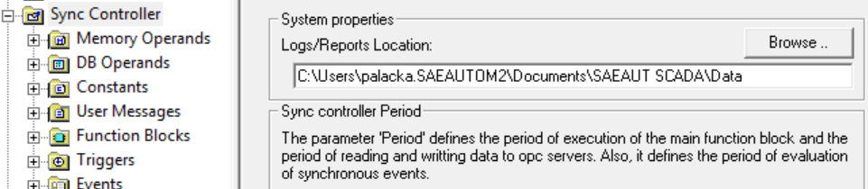
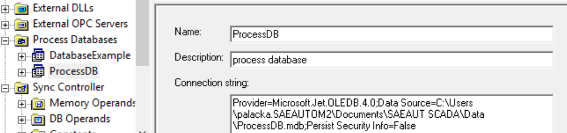

# OpcDbGatewayEnhancements

*OpcDbGateway enhancements, configurations and process databases*

## What is OpcDbGateway

OpcDbGateway enables integration of software applications to collect, process and visualize data from different devices and data sources.

It is *application software development environment* consisting of IDE (GUI) for creating and debugging applications and a runtime engine/application without IDE. GUI is a configuring application (Configurator) that enables configure connections to different data sources as databases, OPC server/client applications, DDE servers using different wizards providing high effectivity. It also enables to configure application logic using configurable commands. The base functionality of the product can be *enhanced by custom programmed modules*. This repository contains examples of custom programmed modules configurations and process databases.

## Product information, download, documentation

* [Product web](http://www.saeautom.sk/en/products/opcdbgateway/)
* OpcDbGateway downloads: [first](http://www.saeautom.sk/download/products/opcgway/OpcDbGateway_Setup.zip),
  [second](http://www.sae-automation.dtadsl.sk/products/opcgway/OpcDbGateway_Setup.zip)
* Documentation [pdf](http://www.saeautom.sk/download/help/opcdbgateway_en.pdf), [web](http://home.gts.sk/saeautomation/help/opcdbgateway/index.html)

## SAEAUT SCADA

SAEAUT SCADA software package has the same functionality as OpcDbGateway but it contains also universal web UI.

* [Product web](http://www.saeautom.sk/sk/products/scada)
* OpcDbGatway downloads: [first](http://www.saeautom.sk/download/products/opcgway/SAEAUT_SCADA_Setup.zip),
  [second](http://home.gts.sk/saeautomation/products/opcdbgw/SAEAUT_SCADA_Setup.zip)
* Documentation [pdf](http://www.saeautom.sk/download/help/SaeautScadaHelp.pdf), [web](http://home.gts.sk/saeautomation/help/saeautscada2/index.html)

## Enhancement DLL demo

An example of enhancement DLL can be found in installation packages of above-mentioned products. Other enhancements will be published in this GitHub repository. Here will be published also links to OpcDbGateway enhancement DLLs, configuration databases and process databases from external contributors.

## How to run applications from these repositories

Standard installation places different files and directories to your  directory structure. 	Because of this, when you use demo configurations and database from these GitHub repositories it is necessary to adapt following settings:

* **Placement of data produced by application** e.g. log files: in my case, they are placed in directory *C:\Users\palacka.SAEAUTOM2\Documents\SAEAUT SCADA\Data* as can be seen in Figure 1. After installation SAEAUT SCADA, you can see default placement of your directories by using installed demo-configuration ExampleConfiguration.ODG. You can copy/paste this directory to a configuration that you have downloaded from this Github repository

*Figure 1. Path to log files and other data directories* ) 

* **Connect string to default process database** - you can also use connect string from installed ExampleConfiguration.ODG like in Figure 2.

*Figure 2. Connection string to log files and other data directories* 

Anyway, before using any configuration from this Github repository, it is useful to use the configuration checking functionality of the OpcDbGateway configurator and solve all errors and warnings.